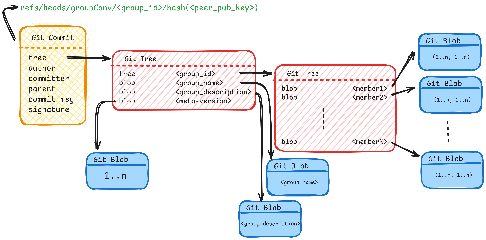

# 📡  P2P Offline Group Messaging App

An **offline P2P group messaging application** designed for small community groups, where the app is independent of central servers.

> 🎓 This project was part of my **MSc Thesis at the University of Basel, CH**.
<!-- > 🎓 This project was part of my **MSc Thesis under [Computer Networks Group](https://cn.dmi.unibas.ch/en/) at the University of Basel, CH**. -->

---

## 🧭 Overview

The goal of this project is to build a **fully offline P2P group chat system** that operates without:
- Centralized servers
- Persistent internet connectivity
- Dedicated infrastructure running 24/7

### Key Characteristics
- Fully decentralized peer-to-peer architecture  
- Offline-first design  
- No central coordination or server dependency 
- CRDTs 
- Command-line interface (CLI)  
- Designed for small, local community groups  

## 📁 Repository Structure

The repository is organized as follows:

- **[implementations](https://github.com/abhilashmendhe/P2P-Group-Chat-App/tree/main/implementations)/** 
  Contains the core application source code.  
  Implementations are provided in:
  - **Bash**
  - **Rust**

- **[helper-scripts](https://github.com/abhilashmendhe/P2P-Group-Chat-App/tree/main/helper-scripts)/** 
  Includes scripts used during evaluation and testing, as well as:
  - Analysis and measurement scripts  

- **[deployment-scripts](https://github.com/abhilashmendhe/P2P-Group-Chat-App/tree/main/deployment-scripts)/**  
  - Bash scripts for deploying multiple peers using **Docker**, primarily for experimentation and evaluation.
  - Experimental test setups.

<!-- --- -->

## Illustration

The idea is to build a consensus-free **P2P Group Chat** using CRDTs [1.]. Our core focus was on group membership model, designing group operations APIs like add/remove member etc. can be found in **[implementations](https://github.com/abhilashmendhe/P2P-Group-Chat-App/tree/main/implementations)/** README file. And, how do the group state converges without needing a consensus. Therefore, we used CRDTs [2., 3.].

### Implementation Design

We embedded our CRDTs in the Git objects. Our idea of implmentation is similar to *Merkle-CRDTs* [4.], but we don't build our own *Merkle-DAG* from scratch, instead we use *Git*. 

- Above is the structural representation of mapping CRDTs to *Git objects*. 
- Each commit is like a message exchanged between group users that points to a *tree object*.
- The *tree object* pointed by the *commit* stores group information like group name, and description. This *tree object* itself points to another *tree object*.
- The *second tree object* stores the *members*, and each member value is like a tuple(size=2) which is our grow-only counters. The *first tuple value* indicates the presence of a member where as the *second tuple value* denotes the admin presence.
- Each commit object is pointed by *git reference*. If a group has N members, then each group will have N references.

The above design is just a high level design and we won't go much into detail explanation.

## References
1. *Marc Shapiro, Nuno Preguiça, Carlos Baquero, and Marek Zawirski*, **Conflict-free replicated data types**. URL: https://arxiv.org/abs/1805.06358, 2011.
1. *Weihai Yu and Sigbjørn Rosta*, **A Low-Cost Set CRDT Based on Causal Lengths**. URL: https://nva.sikt.no/registration/0198cc5de8b2-ae7d8d7f-4359-4729-a7c0-46e59e059714, 2020.
1. *Erick Lavoie*, **State-based ∞p-set conflict-free replicated data type**. URL: https://arxiv.org/abs/2304.01929, 2023.
1. *Hector Sanjuan, Samuli Poyhtari, Pedro Teixeira, Ioannis Psaras*, **Merkle-CRDTs: Merkle-DAGs meet CRDTs**. URL: https://arxiv.org/abs/2004.00107, 2020. 

## 📌 Repository Notice

- This repository is a continuation of the following **archived repository**:
    - [Thesis-crdt-bash](https://github.com/abhilashmendhe/Thesis-crdt-bash)  
    - [Thesis-CRDT-Scripts](https://github.com/abhilashmendhe/Thesis-CRDT-Scripts) 
- Moreover, this repository contains additional codes which were not pushed in the archived repositories.

- Additional code and improvements that were **not included in the archived repositories** are available here.

- ✅ **All future development and updates will take place in this repository.**  
- ❌ Please do **not** use or reference the archived repositories..

## 🚫 Issues & Contributions

- Please **do not open issues or submit pull requests**.
- This repository is **not actively maintained for public collaboration**.
- It exists solely for **personal development and documentation** related to my MSc thesis.

---

## 📜 License

This project is licensed under the [**BSD 3-Clause License**](https://github.com/abhilashmendhe/P2P-Group-Chat-App/blob/main/LICENSE) © 2026, Abhilash.
